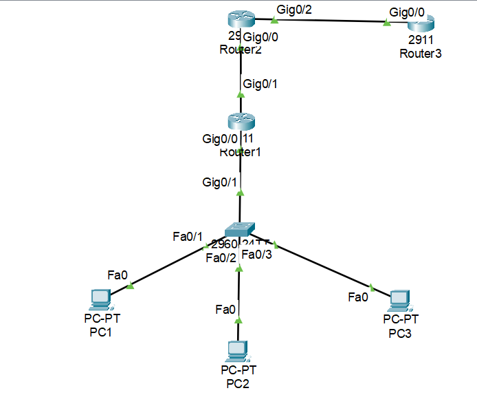
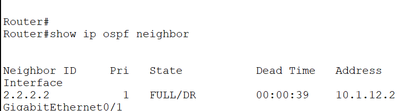
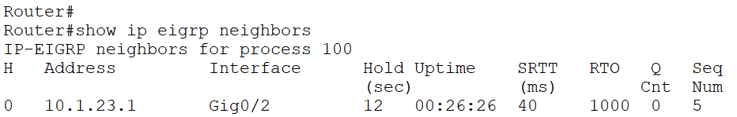

# CCNA Network Topology Simulator

## Overview

This project demonstrates multiple CCNA networking concepts implemented in Cisco Packet Tracer.

## Features

- VLAN 10, 20, 30
- Router-on-a-Stick
- Inter-VLAN Routing
- OSPF Area 0
- EIGRP AS 100
- OSPF-EIGRP Redistribution
- STP PVST+
- Loopback Interfaces
- Route Advertisement
- End-to-End Connectivity Testing

## Topology

## Devices

### Router1
- OSPF Area 0
- NAT/PAT Ready
- Router-on-a-Stick

### Router2
- OSPF + EIGRP
- Redistribution

### Router3
- EIGRP AS 100

### Switch1
- VLANs 10,20,30
- Trunk Configuration
- PVST+

## Verification

### OSPF Neighbor

### EIGRP Neighbor

## Skills Demonstrated

- Routing Protocols
- VLAN Configuration
- Switching
- Troubleshooting
- Cisco Packet Tracer
- Network Design

## Author

Amrutha G S
